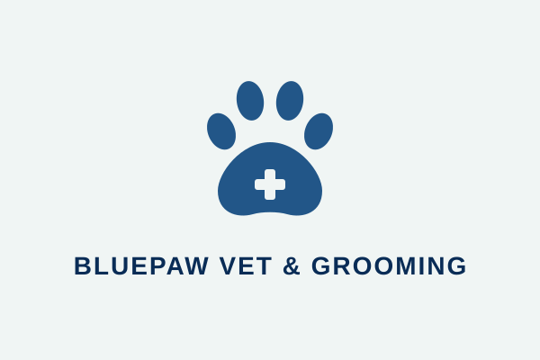

<div align="center">
  
  
  # 🐾 BluePaw Vet & Grooming
  
  **Solusi Kasir & Manajemen Terpadu Klinik Hewan Peliharaan yang Modern**<br>
  *Dibangun dengan Java Swing + FlatLaf — Ringan, Cepat, dan Siap Pakai*

  
  
  
  
</div>

<br>

## 📖 Deskripsi Aplikasi

**BluePaw Vet & Grooming** adalah aplikasi desktop berbasis Java Swing yang dirancang khusus untuk memenuhi kebutuhan administrasi dan kasir pada klinik dokter hewan serta pusat perawatan hewan peliharaan (*pet grooming*). 

Aplikasi ini menghadirkan antarmuka modern dengan **Custom Blue Palette** menggunakan framework **FlatLaf**, dukungan ikon vektor **SVG** beresolusi tinggi, navigasi multi-tab yang intuitif, serta kalkulasi biaya layanan secara **real-time** yang adaptif terhadap bobot hewan.

> **✨ UI/UX Highlight:**
> Antarmuka dirancang layaknya *dashboard* modern bergaya "Card", memberikan pengalaman kasir yang mulus tanpa kesan aplikasi desktop lawas.

*(Tambahkan Screenshot Aplikasi Anda di sini)*
``

---

## 🚀 Fitur Utama

- **📋 Registrasi Pasien & Layanan Komprehensif**
  Input data pemilik, nama hewan, jenis, dan bobot. Tersedia pilihan layanan lengkap: *Grooming*, Vaksinasi, Pakan Khusus, *Checkup*, Rawat Inap, dan Bedah Minor. Dilengkapi pemilihan dokter jaga (Drh. Budi, Drh. Sarah, Drh. Andi).
- **⚡ Kalkulasi Harga Dinamis (Real-time)**
  Total tagihan dihitung otomatis setiap kali form diubah. Sistem dilengkapi sensor **Surcharge bobot ≥ 5 kg**, otomatis menambahkan Rp 20.000 per layanan medis untuk hewan berukuran besar.
- **💳 Sistem Pembayaran Cerdas (Cash & QRIS)**
  Beralih antar metode secara instan. Mode Cash akan otomatis menghitung kembalian. Mode QRIS akan memunculkan barcode pintar di layar (*paperless*). Tombol cetak dilindungi validasi pembayaran.
- **🖨️ Cetak Nota Digital**
  Menghasilkan rincian (*invoice*) yang rapi berisi data pasien, layanan, metode pembayaran, dan status transaksi.
- **📂 Manajemen Riwayat Transaksi (CRUD)**
  Pantau semua transaksi pada Tab Riwayat. Kasir dapat melakukan Edit (mengembalikan data ke form), Batal/Hapus, atau menandai transaksi Selesai.

---

## 🎨 UI/UX & Custom Palette

Aplikasi ini tidak menggunakan tema bawaan Java yang kaku. Kami mengimplementasikan estetika medis yang bersih:

| Elemen              | Warna            | Kode Hex  | Preview (Opsional) |
|---------------------|------------------|-----------|--------------------|
| **Background**      | Putih Bersih     | `#FFFFFF` | ⬜                 |
| **Card / Form**     | Biru Terang      | `#c0e6fd` | 🟦                 |
| **Border**          | Biru Medium      | `#80aad3` | 🪼                 |
| **Primary Button**  | Biru Solid       | `#3f6593` | 📘                 |
| **Teks Utama**      | Biru Sangat Gelap| `#000f22` | ⬛                 |

---

## 🛠️ Teknologi & Tools

- **Bahasa:** Java 11+ (OOP Design Pattern)
- **UI Framework:** Java Swing
- **Look & Feel:** FlatLaf 3.2.5 (*FlatMacLightLaf*)
- **Vector Assets:** `flatlaf-extras` 3.2.5 + `jsvg` 1.3.0
- **Runner:** Standalone batch script (`run.bat`)

<details>
<summary><b>📂 Lihat Struktur Proyek</b></summary>

```text
Petcare/
|-- PetCareGUI.java        # Kelas utama GUI (JFrame + JTabbedPane)
|-- UIHelper.java          # Utilitas warna, factory komponen, SVG loader
|-- OrderRecord.java       # Model data transaksi (Serializable)
|-- PasienHewan.java       # Model data pasien hewan
|-- LayananGrooming.java   # Model data layanan grooming
|-- bluepaw-logo.svg       # Logo vektor aplikasi
|-- qris_dummy.png         # Gambar barcode QRIS placeholder
|-- run.bat                # Script kompilasi & jalankan (Windows)
|-- README.md              # Dokumentasi proyek ini
|-- lib/
|   |-- flatlaf-3.2.5.jar
|   |-- flatlaf-extras-3.2.5.jar
|   |-- flatlaf-intellij-themes-3.2.5.jar
|   `-- jsvg-1.3.0.jar
```
</details>

---

## 💻 Cara Menjalankan Aplikasi

### Prasyarat:
Pastikan **Java JDK 11** (atau lebih baru) sudah terinstal dan terdaftar di `PATH` sistem operasi Anda. Proyek ini memuat library JAR langsung di folder `lib/`.

### Langkah-langkah:
1. **Clone Repositori:**
   ```bash
   git clone <url-repositori-anda>
   cd Petcare
   ```
2. **Jalankan via Script (Khusus Windows):**
   Klik dua kali file `run.bat` di dalam folder, atau jalankan melalui terminal:
   ```cmd
   .\run.bat
   ```
3. **Jalankan Manual (Mac/Linux/Windows):**
   ```bash
   # Kompilasi
   javac -cp ".;lib/*" *.java
   
   # Jalankan (Pastikan file .svg dan .png ada di folder yang sama)
   java -cp ".;lib/*" PetCareGUI
   ```

---

## 💰 Daftar Harga Layanan (Katalog)

| Kategori | Layanan | Harga Dasar | Surcharge (Bobot ≥ 5kg) |
| :--- | :--- | :--- | :--- |
| **Grooming** | Mandi Kutu | Rp 50.000 | + Rp 20.000 |
| | Potong Bulu | Rp 40.000 | + Rp 20.000 |
| | Potong Kuku | Rp 25.000 | - |
| | Full Grooming | Rp 100.000 | + Rp 20.000 |
| **Medis / Klinik** | Checkup Umum | Rp 75.000 | + Rp 20.000 |
| | Vaksinasi | Rp 100.000 | + Rp 20.000 |
| | Bedah Minor | Rp 250.000 | + Rp 20.000 |
| **Fasilitas** | Rawat Inap | Rp 150.000 | - |
| | Pakan Khusus | Rp 50.000 | - |

---

## 📄 Lisensi
Proyek ini dikembangkan sebagai portofolio dan studi kasus pengembangan aplikasi desktop Java Swing dengan Look & Feel modern. Bebas dipelajari, digunakan, dan dimodifikasi untuk tujuan edukasi.